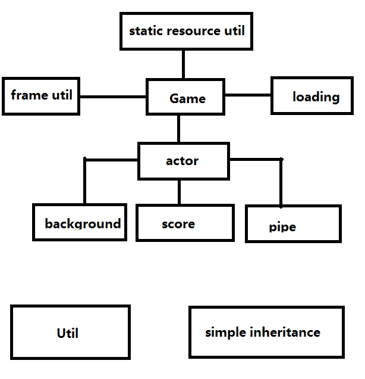

## FlappyBird(像素鸟)
- 简介:
本项目使用观察者模式搭建,使用一个Game类总领全局,
之下有演员管理类,分数类,加载类,及工具类等构成
- 具体思路:
首先由一个Game类,Game类管理着演员管理类,演员管理类负责管理所有的演员,  
演员有地板,树木,房子,管子,鸟,分数;Game类还管理着静态资源加载类,帧工具类,加载类  
- 类的简介及类的关系
Game类: 观察者类,总领全局  
Background类:负责建造地板 树木 房子  
Pipe类:负责建造管子  
Bird类:负责造鸟  
LoadingProgress类:负责新建进度条与开始和重新开始按钮
AcotrManager类:负责管理 Background Pipe Bird 的穿件和更新暂停
FrameUtil类:负责记录FPS和总帧数
ScoreAmount类:负责统计分数
StaticResourceUtil类:负责加载所有静态资源
uitl:一些使用的函数
simpleInheritances:jQuery创始人写的改进类创建及继承方法的代码块

- 项目收获:
初步理解观察者的设计模式,由一个观察者总理所有需要用到的类,每个类与类之间的通讯都必须经过
观察者类,绝对不能绕过观察者类进行通讯